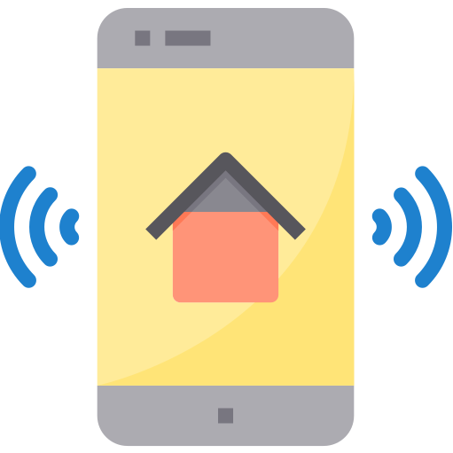
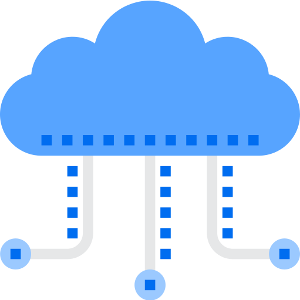
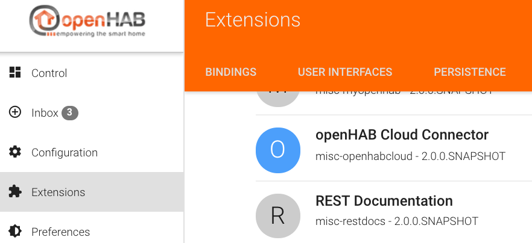
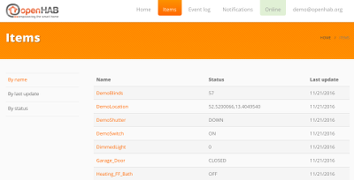
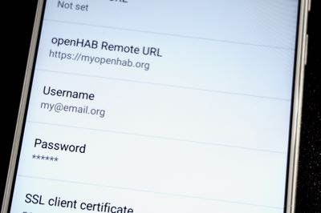
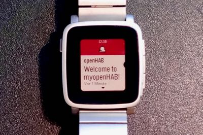
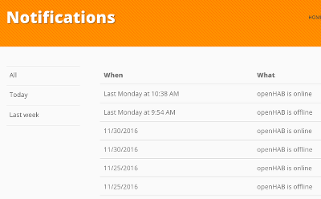
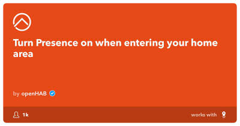
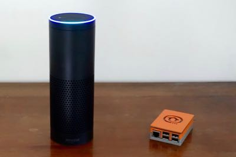
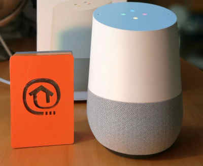

<h1 class="big-title header">Welcome to <em>my</em></h1>

<h2 class="subtitle">myopenHAB is an instance of the <a target="_blank" href="https://github.com/openhab/openhab-cloud">openHAB Cloud service</a>, which is hosted by the <a target="_blank" href="https://www.openhabfoundation.org/">openHAB Foundation e.V.</a></h2>


We are offering this service completely for free. It is meant to allow users to quickly check out its features without having to set up and host a personal instance.

Although it is mainly meant as a demonstrator, it is absolutely fine to use it for your production system as well. You must be aware though that we cannot offer any SLAs regarding availability etc, but we promise to keep it up and running to the best of our capabilities. Please read our [Terms of Use](terms.html) for all details.

If you use and love this free service, please consider becoming a member of the openHAB Foundation or do a [one-time donation](https://www.openhab.org/about/donate.html), which will allow us to move forward and further work in the interest of the openHAB community!

<div style="text-align: center">
<a class="sign-up-button" href="https://myopenhab.org/login">Sign up Now ➜</a>
</div>

<h2 class="big-title">Features</h2>

  <div class="home">
    <div class="features">
      <div class="feature">
        <div class="panel panel-default text-center">
          <div class="panel-body">
            
          </div>
          <div class="panel-heading">
            <h4>Remote Access</h4>
            <p>Access your local openHAB instances securely without having to expose ports to the Internet or requiring a complex VPN setup.</p>
          </div>
        </div>
      </div>
      <div class="feature">
        <div class="panel panel-default text-center">
          <div class="panel-body mb_panel-heading">
            
          </div>
          <div class="panel-heading">
            <h4>Push Notifications</h4>
            <p>Receive push notifications on your smartphone through a connection to Google Cloud Messaging (GCM) or Apple Push Notifications (APN).</p>
          </div>
        </div>
      </div>
      <div class="feature">
        <div class="panel panel-default text-center">
          <div class="panel-body">
            
          </div>
          <div class="panel-heading">
            <h4>3rd Party App Integration</h4>
            <p>Connect your openHAB smart home to cloud-based platforms and services such as IFTTT, Amazon Alexa or Google Assistant.</p>
          </div>
        </div>
      </div>
    </div>
  </div>

<router-link to="/imprint.html#icon-attribution" style="font-size: 8pt; color: #bbb; display: block; text-align: right">Icons from Flaticon</router-link>

<h2 class="big-title">Setup and Configuration</h2>

<br />



### openHAB Runtime

In order to use myopenHAB, you will need to install and configure the [openHAB Cloud Connector](https://www.openhab.org/addons/integrations/openhabcloud/) bundle on your local openHAB runtime. This bundle establishes the connection to myopenHAB.org and authenticates against it.

Please check the documentation for openHAB 1.8 or for openHAB 2 (requires a recent snapshot).

<div style="clear:both"></div>



### Web Access

Once you have successfully set up the cloud connector, you can log in here at [https://myopenhab.org/login](https://myopenhab.org/login), which gives you remote web access to the web UIs of your openHAB runtime and also lets you check the state of exposed items, notifications and events.

<div style="clear:both"></div>



### Mobile Apps

If you want to use myopenHAB through your native Android, iOS or Pebble apps, please enter `https://myopenhab.org` as a remote URL, and your myopenHAB account username and password as credentials.

<div style="clear:both"></div>



### Push Notifications

Once you have set up your mobile app to connect to myopenHAB, it will automatically register itself to receive push notifications. Now you can use special actions in your openHAB rules to send notifications - below are some examples.

<div style="clear:both"></div>

- This will send a notification with "Hello world!" to your device. If you use multiple devices with the same account configured, all of them will receive the notification:

```java
sendNotification("your@email.address", "Hello world!")
```

- This will send a notification with "Hello world!" to all devices of all users of your myopenHAB account:

```java
sendBroadcastNotification("Hello world!")
```

- This will send a log notification with "Hello world!". Log notifications are not sent to devices, they are only kept in the notifications list and are available in the notifications area of myopenHAB and the mobile apps:

```java
sendLogNotification("Hello world!")
```

::: tip
You can test whether notifications are correctly sent to any of your mobile devices by going to the _Devices_ section of myopenHAB.org and sending a test message.
:::



### Status Notifications

Every time your openHAB connects to myopenHAB or disconnects from it, you will automatically receive a notification to your devices telling you that openHAB went online or offline. myopenHAB has a 300 seconds (5 minute) delay for sending those notifications. When your openHAB goes offline we will wait for 5 minutes. If your openHAB goes online during this period, nothing will happen and we will not bother you. If not, we will notify you that your openHAB is offline.

<div style="clear:both"></div>



### IFTTT

Activating the [IFTTT](https://ifttt.com/services/openhab) integration is easy. Just log in to your IFTTT account and activate the openHAB channel. You will be forwarded to the myopenHAB website to authorize the IFTTT channel connection. Before you start creating IFTTT recipes you need to make sure that you have your runtime configured to expose certain items to myopenHAB. Only those items will be visible to IFTTT. You will also be able to send commands to those items from IFTTT Applets. Items will appear in myopenHAB and thus in IFTTT only after at least one state update has been received by myopenHAB from your runtime.

There are plenty of [applets](https://ifttt.com/search/query/openhab) for openHAB to choose from!

You can delete the IFTTT authorization token in the myopenHAB _Applications_ section at any time.

<div style="clear:both"></div>



### Amazon Alexa

We have published an [openHAB Alexa Smart Home skill](https://www.amazon.de/openHAB-Foundation/dp/B01MTY7Z5L), based on the [code](https://github.com/openhab/openhab-alexa) that is maintained by the community.

You can simply activate this skill in your Alexa app. You need to make sure that all items that you want to control through your Amazon Echo are correctly tagged (similar to the [HomeKit](http://www.openhab.org/addons/integrations/homekit/) integration and that you have enabled remote access in your cloud connector.

Check out the [documentation article](https://www.openhab.org/docs/ecosystem/alexa/) to learn more on how to configure your installation.

Please note that the Amazon Echo integration only works with openHAB 2.

<div style="clear:both"></div>



### Google Assistant

We have published a [Google Assistant Action](https://assistant.google.com/services/a/uid/000000f5c61c627e?hl=en-US&source=web), based on the [code](https://github.com/openhab/openhab-google-assistant) that is maintained by the community.

The openHAB Action links your openHAB setup through the myopenHAB.org cloud service to the Google Assistant platform (for technical insights, please refer to the link above to read more about setup options and development information).

With the Action you can voice control your openHAB items and it supports lights, plugs, switches and thermostats. The openHAB Action comes with multiple language support like English, German or French.

Check out the [documentation article](https://www.openhab.org/docs/ecosystem/google-assistant/) to learn more on how to configure your installation.

Please note that the Google Assistant integration only works with openHAB 2.

<div style="clear:both"></div>


<style lang="stylus">
.sign-up-button
    margin 2rem
    display inline-block
    text-align center
    font-size 1rem
    color #ff6600
    padding 0.8rem 1.6rem
    border-radius 4px
    font-family 'Open Sans', sans-serif
    font-weight bold
    transition background-color .1s ease
    box-sizing border-box
    border 2px solid #ff6600
    &:hover
        background-color #ff6600
        color white
        text-decoration none !important

.feature
    text-align center
    img
        height 150px
    h4
        font-family 'Open Sans', sans-serif
        font-weight bold
        font-size 14pt
</style>